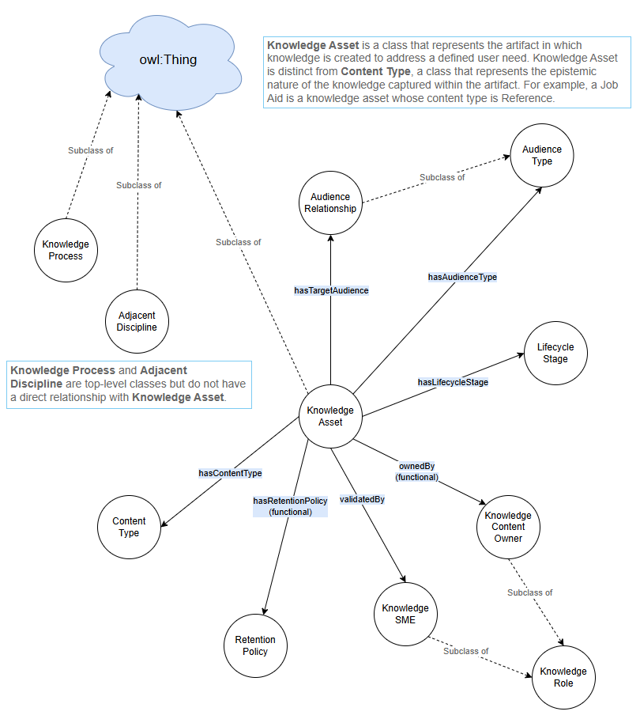
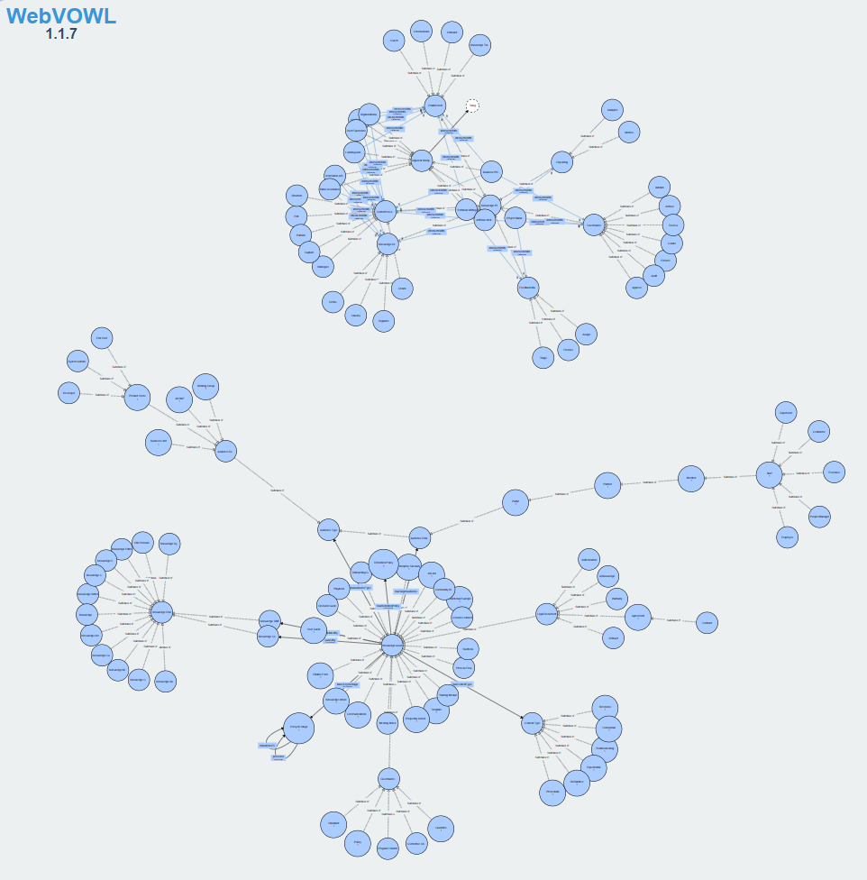
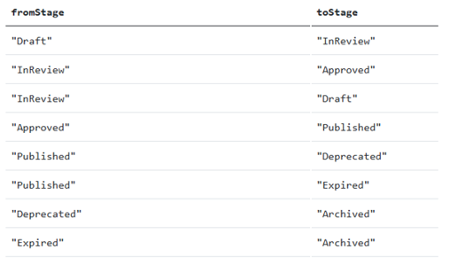
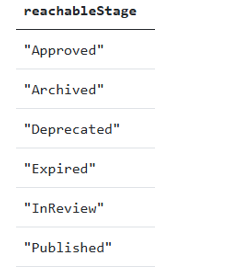
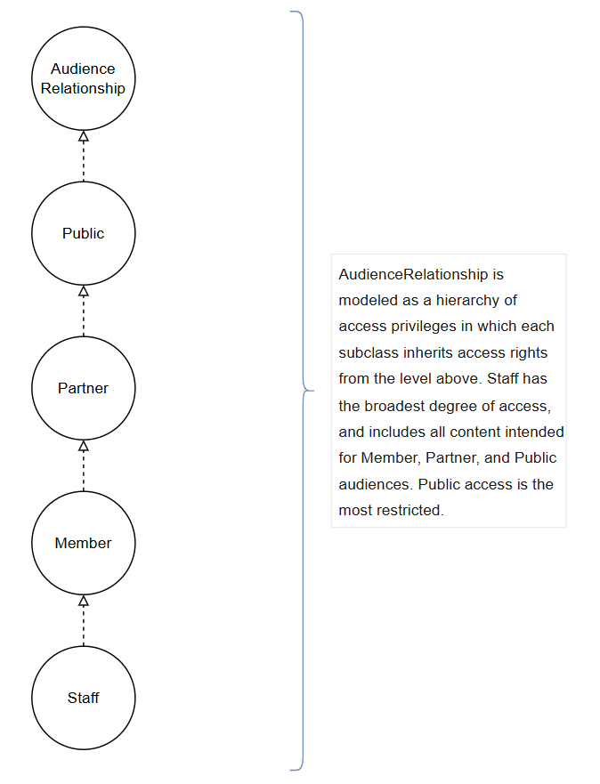
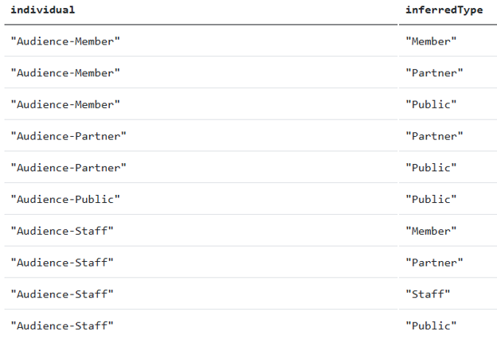

# Ontology Practice 1: Knowledge Management
## Contents
- [My KM ontology](#My-KM-ontology) <br>
- [Ontology details](#Ontology-details) <br>
- [Challenges & key decisions](#Challenges) <br>
- [Left undone](#Undone) <br>
- [Acknowledgements](#Acknowledgements) <br>

<a name="My-KM-ontology"></a> 
## My KM ontology
As mentioned in the [Introduction](https://thomas-m-chapman.github.io/Ontology-Practice.html#Introduction), the Knowledge Management (KM) ontology that I created is a sample conceptualization of the knowledge management domain based on my experience leading KM programs at Dell EMC and BECU. There is no ISO standard for a KM ontology. If you were to create a KM ontology based on your experience in knowledge management, it might differ considerably from what you see here.

For this ontology, I chose to define eight facets (as classes) that are common to many knowledge management programs, including the roles that KM team members might play, the many different kinds of knowledge assets that might populate your knowledge base, the content types that might best describe each of your knowledge assets, standard stages of the KM lifecycle, a handful of audience types, various processes common to the KM function, a governance retention policy, and several professional disciplines that often overlap with the KM practice.

Examples for each of the facets include:

| **Facet**        | **# Defined classes**       | **Examples**                          |
|:----------------:|:---------------------------:|:--------------------------------------|        
| **Knowledge Roles**  | 14                          | knowledge manager, knowledge analyst, knowledge champion |
| **Knowledge Assets** | 31                          | knowledge article, job aid, enterprise glossary, user guide |
| **Content Types**    | 7                           | conceptual, procedural, reference, experiential |
| **Lifecycle Stages** | 7                           | draft, in review, published, archived |
| **Audience Type**    | 18                          | public, partner, member, staff |
| **Knowledge Process** | 31                         | enablement, governance, feedback management, reporting |
| **Adjacent Discipline** | 10                       | Technical Writing, Learning and Development, Change Management |
| **Retention Policy** | 1                           | Legal 6-Year Retention policy |

<br>
All in all, the KM ontology consists of:
  - 8 super classes and 111 subclasses, spanning the facets listed above
  - 10 object properties modeling relationships such as *hasRetentionPolicy* and *validatedBy*
  - 39 individuals, or instances, of audience type, content type, lifecycle stage, retention policy, and a handful of select knowledge assets
  - 227 annotation assertions, which provide names and definitions for each entity

The following diagram illustrates the class hierarchy of the KM ontology and provides a good high-level depiction of its contents.
&nbsp;

<br>
The visualization below, from WebVOWL, provides a more exploded view of the ontology (though the details are impossible to read). 
&nbsp;

<br>
To [explore the ontology in full](https://thomas-m-chapman.github.io/Ontology-Practice.html#Explore), download the ontology (KM-ontology.ttl) and open it in either Protégé or WebVOWL. 

<a name="Ontology-details"></a> 
## Ontology details
The KM ontology includes detailed *annotations* (in the form of RDF labels and comments) that describe each class, subclass, and individual defined in the ontology. For example, the Runbook knowledge asset is defined as:

| **Label**      | **Comment**     |
|:--------------:|:----------------|
| Runbook        | A document that captures explicit, step-by-step instructions for executing a defined task. Distinguished from a Playbook by its prescriptive nature, a Runbook assumes conditions are sufficiently predictable. Deviation from its guidance is discouraged. |

Further, **Knowledge Asset** is *disjoint* and has the following object properties:
  - *hasAudienceType*
  - *hasContentType*
  - *hasLifecycleStage*
  - *hasRetentionPolicy*
  - *hasTargetAudience*
  - *ownedBy*
  - *validatedBy*

**Knowledge Role**, on the other hand, is intentionally not *disjoint*, which conveys the fluid nature of roles in practice: Any one person can perform any number of roles. 

**Content Type** is *disjoint*, enforcing the practice of defining a single DITA type for atomic/modular knowledge assets. Following this logic, a user guide would not have a content type itself, but each component that makes up the user guide would.

**Lifecycle Stage** is constrained by the *precedes* and *transitionsTo* object properties, enforcing a linear progression from, for instance, Draft to Published to Archived status.

**Audience Type** consists of two subclasses:
  - **Audience Relationship**, which defines the relationship of a specified audience to the company/organization. Internal staff are further classified as contractors, employees, and leadership levels.
  - **Audience Segment**, which defines the organizational scope of a specified audience, such as to convey that an entity pertains to all staff, a single division or business unit or working group, or a set of product users.

**Knowledge Process** is *disjoint* to reflect that each broad category of activities (such as Enablement or Governance) is distinct from another.

**Adjacent Discipline** is *disjoint* for the same reason, and also leverages the *intersectsWith* object property to capture overlapping responsibilities between disciplines.


<a name="Challenges"></a> 
## Challenges & key decisions
### The “Deleted” lifecycle stage
One of the first modeling challenges that I encountered was a basic one: How to model the lifecycle stage pertaining to the deletion of a knowledge asset. 

After considerable thought, I realized that modeling a lifecycle stage for the disappearance of an entity is the wrong thing to do. After all, the point of an ontology is to model entities that exist, as well as the relationships between those entities. A deleted knowledge asset does not exist and therefore doesn’t belong in the ontology whatsoever. It would have no properties to describe, no relationships to establish, and no audience to target. Modeling it would be an error, as I’d be attempting to model the absence of a thing as if it were a thing. This realization served as a good reminder of a fundamental modeling principle: If a class exists with nothing instantiated against it, the class probably shouldn’t be there.

With “Deleted” removed, the lifecycle stage “Archived” becomes the sole terminus for knowledge assets that have reached end of life, reflecting that while the asset has been removed from publication, it remains available for legal, compliance, and historical reasons.

### Lifecycle stages
Removing “Deleted” from the list of valid lifecycle stages yielded a clean, linear progression of a knowledge asset, from Draft through Archived status. With that established, I wanted to model the logical progression—and any allowed regression—that typically occurs during the content development process. 

To do this, I created Lifecycle Stage as a class, and then defined *precedes* and *transitionsTo* object properties to enforce valid transitions from one state to another. While the ideal flow looks like this:

&nbsp;
<br>
The model allows for state changes from InReview to Draft, as well as InReview to Published, allowing for both routes that are so common to iterative content development.

In Turtle, this is represented as: 
```
###  http://www.semanticweb.org/thoma/ontologies/2026/02/Knowledge-Management#precedes
Knowledge-Management:precedes rdf:type owl:ObjectProperty ,
                                   owl:TransitiveProperty ;
                 rdfs:domain Knowledge-Management:LifecycleStage ;
            rdfs:range Knowledge-Management:LifecycleStage ;
rdfs:comment "General ordering relationship between lifecycle stages. Transitive: if A precedes B and B precedes C, then A precedes C. Inferred from the transitionsTo sub-property chain." .

###  http://www.semanticweb.org/thoma/ontologies/2026/02/Knowledge-Management#transitionsTo
Knowledge-Management:transitionsTo rdf:type owl:ObjectProperty ;
              rdfs:subPropertyOf Knowledge-Management:precedes ;
                rdfs:domain Knowledge-Management:LifecycleStage ;
                        rdfs:range Knowledge-Management:LifecycleStage ;
rdfs:comment "An explicit permitted transition between two lifecycle stages. Non-transitive. Sub-property of precedes; every asserted transition implies a precedes relationship." .

```

#### Test 1: Progression of lifecycle stages 
To verify that I had modeled the lifecycle stages correctly, I uploaded the ontology to SPARQL Playground and ran a couple of SPARQL queries against it.

The first query asks which lifecycle stages are permitted from one stage to the next, beginning with the Draft stage.

**Query text:**
```
PREFIX km: http://www.semanticweb.org/thoma/ontologies/2026/02/Knowledge-Management#>
SELECT ?fromStage ?toStage
WHERE {
    ?from a km:LifecycleStage ;
          km:transitionsTo ?to .
    BIND(STRAFTER(STR(?from), "#") AS ?fromStage)
    BIND(STRAFTER(STR(?to),   "#") AS ?toStage)
    VALUES (?from ?order) {
        (km:Draft 1)
        (km:InReview 2)
        (km:Approved 3)
        (km:Published 4)
        (km:Deprecated 5)
        (km:Expired 6)
        (km:Archived 7)
    }
}
ORDER BY ?order ?toStage

```

**Query results:**

&nbsp;

The query results show that the model has been designed as intended, allowing for the possibility that a knowledge asset may progress from In Review to Approved, or may regress from In Review to Draft status. 

Just so, a Published knowledge asset may progress to either Deprecated or Expired, and a knowledge asset may be Archived only after it has been either Deprecated or Expired.

#### Test 2: Lifecycle stages after Draft
I then wanted to make sure that transitivity inference is working as expected (which I believe the Reasoner had validated already). This SPARQL query asks for all stages that can be reached following the Draft stage. 

**Query text:**
```
PREFIX km: <http://www.semanticweb.org/thoma/ontologies/2026/02/Knowledge-Management#>
SELECT DISTINCT ?reachableStage
WHERE {
    km:Draft km:transitionsTo+ ?to .
    FILTER(?to != km:Draft)
    BIND(STRAFTER(STR(?to), "#") AS ?reachableStage)
}
ORDER BY ?reachableStage

```

**Query results:**

&nbsp;
<br>
The query results show that the model has been designed as intended. Archived is indeed a reachable state even though it isn’t a direct *transitionsTo* descendent of Draft, which confirms that transitivity inference is working as expected.

### Governance & retention policies
In an established KM practice, all knowledge assets are governed to some degree. It’s not uncommon, however, for organizations to govern some knowledge assets with more scrutiny than others. I captured this in my ontology by defining two data properties:
- *isGoverned*: Indicates whether a knowledge asset is subject to formal authority governance.
- *hasGovernanceBody*: Indicates whether board, committee, or other designated authority holds explicit oversight responsibility over a knowledge asset.

I also modeled a retention policy that governs how long a knowledge asset must be retained once archived (*retentionPeriod* and *retentionUnit*), whether the retention period is necessitated by Legal, Compliance, or Operations (*retentionType*), and the action to be taken when the retention period ends (*dispositionActivity*).

This Turtle snippet shows the retention policy for a policy called Legal 6-Year Retention:
```
###  http://www.semanticweb.org/thoma/ontologies/2026/02/Knowledge-Management#retentionPeriod
Knowledge-Management:retentionPeriod rdf:type owl:DatatypeProperty ;
                  rdfs:domain Knowledge-Management:RetentionPolicy ;
   	                                     rdfs:range xsd:integer ;
rdfs:comment "Duration of the retention period expressed as an integer. Use in conjunction with retentionUnit." .

###  http://www.semanticweb.org/thoma/ontologies/2026/02/Knowledge-Management#RP-Legal-6Year
Knowledge-Management:RP-Legal-6Year rdf:type owl:NamedIndividual ,
                            Knowledge-Management:RetentionPolicy ;
               Knowledge-Management:dispositionActivity "Review" ;
                          Knowledge-Management:retentionPeriod 6 ;
                      Knowledge-Management:retentionType "Legal" ;
                      Knowledge-Management:retentionUnit "Years" ;
rdfs:comment "The legal retention policy is applied to member-facing financial documents, legal agreements, and regulated communications. Reflects the organization's accepted legal retention requirement." ;
rdfs:label "Legal 6-Year Retention" .

```

### Access rights hierarchy
Many knowledge platforms enable you to define graduated levels of access privileges, and I wanted my ontology to do the same. I modeled access rights in a hierarchy, leveraging the group of audience relationships, as follows:
&nbsp;

#### Test: Access rights inferences
To make sure that I modeled Access Rights correctly, I wrote the following SPARQL query to validate that the Reasoner can correctly infer the full privilege hierarchy, from Staff to Public. 

As noted in the illustration above, Public access is the most restricted (meaning the Public can access the fewest knowledge assets), while Staff has the broadest degree of access. 

**Query text:**
```
PREFIX km: <http://www.semanticweb.org/thoma/ontologies/2026/02/Knowledge-Management#>
PREFIX rdf: <http://www.w3.org/1999/02/22-rdf-syntax-ns#>
PREFIX rdfs: <http://www.w3.org/2000/01/rdf-schema#>

SELECT ?individual ?inferredType
WHERE {
    VALUES ?aud {
        km:Audience-Staff
        km:Audience-Member
        km:Audience-Partner
        km:Audience-Public
    }
    ?aud rdf:type ?directType .
    ?directType rdfs:subClassOf* ?inferredClass .
    FILTER(?inferredClass IN
        (km:Staff, km:Member, km:Partner, km:Public))
    BIND(STRAFTER(STR(?aud), "#") AS ?individual)
    BIND(STRAFTER(STR(?inferredClass), "#") AS ?inferredType)
}
ORDER BY ?individual ?inferredType

```

**Query results:**

&nbsp;

<br>
The query results show that each audience type is not only an instance of its directly asserted class, but also an instance of every class above it in the hierarchy.

<a name="Undone"></a> 
## Left undone
Upon reflection, I realize that even this relatively lightweight ontology could be made much more robust. If I return to this exercise, I’ll begin by doing the following.

1.	Model content types more completely to account for outputs compiled from modular components. This might include, for instance, a new subclass of knowledge assets to distinguish between Atomic Asset and Compiled Asset. **Atomic Asset** would be supported with a *hasContentType* object property, while **Compiled Asset** would be supported with an *aggregates* property that points to one or more Atomic Assets. 

2.	Model resolution outcomes for Feedback (Accepted, Rejected, Updated, Retired) as a controlled vocabulary on the Resolve activity, or as a separate Feedback Disposition class.

3.	Add more object properties for Legal documents, including: *hasSignatory*, *requiresWetSignature*, *hasParty*, *isLegallyEnforceable*, *hasEffectiveDate*, *hasExpirationDate*, *requiresNotary*, *requiresOath*, and so on.

4.	Define explicit audience types to account for onboarding, such as *AllPractitioners* and *NewPractitioner*, as well as various stages of the learning journey: *Novice, Intermediate,* and *Advanced*.

<a name="Acknowledgements"></a> 
## Acknowledgements
*This work was conducted using Protégé.*

Ontology editing and reasoning were performed using Protégé Desktop, an open-source ontology editor developed and maintained by the Stanford Center for Biomedical Informatics Research.

Musen, M.A. [The Protégé project: A look back and a look forward. AI Matters](http://www.ncbi.nlm.nih.gov/pmc/articles/PMC4883684/). Association of Computing Machinery Specific Interest Group in Artificial Intelligence, 1(4), June 2015. DOI: 10.1145/2757001.2757003.


