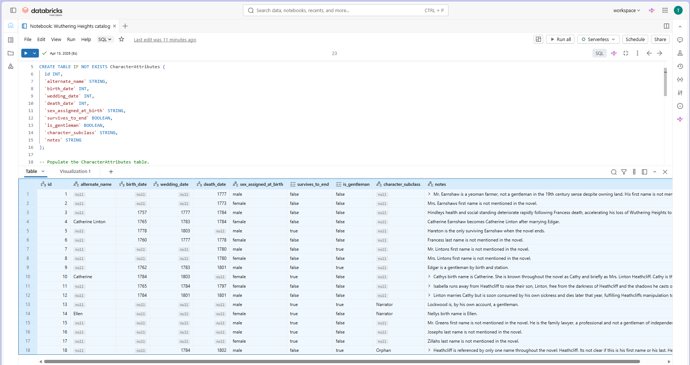
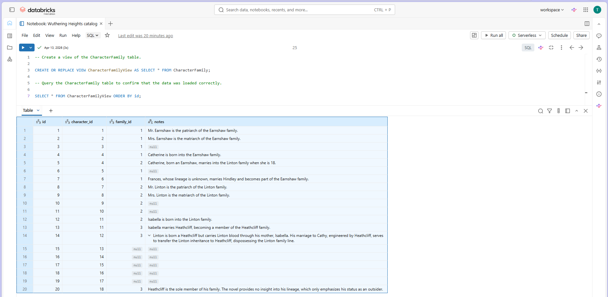
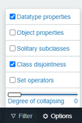

# From Data to Meaning: Ontology Practice
## Contents
- [Introduction](#Introduction)  
- [Background](#Background)  
- [Approach](#Approach)  
- [General learnings](#General-learnings)  
- [Explore the ontologies](#Explore)  
- [Acknowledgements](#Acknowledgements)  

 
## Introduction
I created this piece—and the two practice ontologies that accompany it—in response to the monumental shift that AI has brought to the domain of content operations. Like many in my field, I have years of experience building and maintaining controlled vocabularies and taxonomies, but I’ve never created an ontology before. So, I decided to create one. 

In fact, I created two. 

The first ontology I created is what I’d call a practitioner’s conceptualization of the Knowledge Management (KM) domain. I chose the KM domain because I know it reasonably well and thought it would be interesting to map a sample set of the domain’s entities and their relationships in an ontology.

While I was in the middle of that exercise, I realized that a novel I was reading—Emily Bronte’s *Wuthering Heights*—might provide good fodder for a second ontology, and one that is rich in complex relationships. As I made my way through the novel, I’d wished that it had included a family tree to help easily discombobulated readers like me keep track of who was related to whom. So, for fun, I decided to create a second ontology, this time based on *Wuthering Heights*.

Completing these exercises gave me hands-on experience with the skills this tectonic shift requires: formally modeling entities and their relationships, making deliberate decisions about ambiguous or overlapping categories, and validating queries against a knowledge model. I'm now better equipped to help an organization elicit the tacit knowledge that lives in its content and in the heads of SMEs, and build it into the structured, machine-readable foundation that AI needs to produce trustworthy answers.

 ## Background
At the time of this writing, content professionals continue to search for an answer to a key question: *How do we give AI systems the content they need to produce answers that are true, accurate, and trustworthy?* 

The answer has evolved considerably over the past several years. I see the evolution in three stages:

&nbsp;&nbsp;&nbsp;&nbsp;&nbsp;&nbsp;**Stage 1:** Soon after GenAI was made available, companies started to introduce AI into their content workflows, often with a lot of optimism and little strategy. They integrated LLMs into their environments and pointed those LLMs at an uncurated body of content, expecting that the combination of the user’s prompt and the LLM’s pre-training would produce acceptable results. The results were consistently underwhelming, however, which led to Stage 2. 

&nbsp;&nbsp;&nbsp;&nbsp;&nbsp;&nbsp;**Stage 2:** In the years that followed, a new approach became popular: Retrieval Augmented Generation, or RAG. RAG was a significant improvement, as it paired the LLM with a well-defined, curated body of content. In a RAG architecture, user queries are converted into vector embeddings, which are then matched against similarly embedded content using semantic search (rather than keyword search). The LLM then retrieves relevant content from that curated body of knowledge and generates a response based on what it found.
  
&nbsp;&nbsp;&nbsp;&nbsp;&nbsp;&nbsp;Over time, however, the limitations of RAG became apparent. Although RAG was adept at retrieving relevant chunks of content, it didn’t have the information it needed to understand those chunks nor how they related to each other. It couldn’t discern, for example, that two documents used different names for the same policy, or that a product mentioned in one document is a superset of a product mentioned in another. This led us to Stage 3.

&nbsp;&nbsp;&nbsp;&nbsp;&nbsp;&nbsp;**Stage 3:** This is the stage in which we find ourselves today. Those at the forefront of solving this problem appear to have discovered the tools required for LLMs to generate more faithful responses. These tools include, among others, controlled vocabularies, taxonomies, ontologies, knowledge graphs, and context graphs. Together, these tools provide much of the semantic foundation that an LLM needs to understand its target domain. 

I wanted to learn more about this toolchain, and understanding how to create an ontology—which serves as a blueprint for knowledge graphs—seemed like a logical first step.

 
## Approach
Before I could start building my first ontology, I needed to acquaint myself with some common vocabulary, particularly the basics of the Web Ontology Language (OWL), the Simple Knowledge Organization System (SKOS), and the Resource Description Framework (RDF). I didn’t dig deep, just enough to get going. 

I then started conceptualizing the ontology. I created a simple mind map on paper and migrated the results to Excel, mapping out the ontology in tabular format. I realized that I was leaning on my familiarity with database schemas, but that was the best way I could conceptualize the relationships at this point.

I was then ready to define my ontology. I wanted to use an industry-standard ontology tool and quickly discovered Protégé, an open-source ontology editor developed by Stanford University. I downloaded Protégé Desktop, which is more feature-rich than the web version, and worked my way through an instructional guide called *A Practical Guide to Building OWL Ontologies: Using Protégé 5.5 and Plugins Edition 3.2*, by Michael DeBellis. This guide included a popular tutorial, called the pizza tutorial, which proved to be immensely helpful. The guide included helpful details about the ontology Reasoner and its powers of inference, and provided reasonably good definitions of terminology that I needed to become familiar with: disjoint, annotation assertions, existential and universal restrictions, OWL datatype properties, and so on.

I employed the Reasoner in Protégé frequently—generally after every main step—to verify that I hadn’t made a mistake that would be compounded later. To keep the work fluid, I created the classes first, followed by the object properties and then the data properties, and finally the individuals. This approach enabled me to complete the foundation of the ontology with minimal back-and-forth between entity types. Once those elements were in place, I asserted the relationships between individuals.

For the Wuthering Heights ontology, I extended the exercise by re-creating in Databricks the character and relationship tables that I’d built in Excel. I did this partly out of curiosity, but also to validate that the relational structure of the data was sound before I encoded it in OWL. It also gave me a chance to learn a few fundamentals of Databricks, delve deep into the recesses of my memory to write a few SQL queries (sometimes with generous help from the Databricks Genie code editor), and discover the similarities and differences between relational data modeling and ontology modeling. 

The following screenshots illustrate some of the work I did in Databricks.

The following image shows the CharacterAttributes table, which captures many of the data properties that I modeled against each character in the novel, along with a corresponding set of annotations. 
&nbsp;

The following image shows the CharacterFamily table, a simple table defining each character’s unique ID, a foreign key to the Family table, and a corresponding set of annotations.
&nbsp;

Modeling this data in both Databricks and Protégé helped me understand a fundamental difference between databases and ontologies. A database organizes data into two-dimensional tables and establishes only implicit relationships between them. The meaning of those relationships must be interpreted by a human. In an ontology, on the other hand, meaning is encoded in the model itself. Relationships are defined explicitly as graph “edges” that describe the meaning of that relationship, the context in which it applies (via domain and range), and how the relationship functions (via functional, symmetric, transitive, and other such properties). Because this context is built into the ontology itself, a reasoner, including AI, can derive meaning with semantic consistency. In short, databases store data, whereas ontologies model meaning.

 
## General learnings
In addition to scratching the surface of the ontology landscape in OWL, SKOS, and RDF, I also learned my way around both [Protégé](https://protege.stanford.edu/) and [Databricks](https://www.databricks.com/), discovered [WebVOWL](https://service.tib.eu/webvowl/) and [SPARQL Playground](https://atomgraph.github.io/SPARQL-Playground/), and tried my hand at writing a dozen or so SQL and SPARQL queries. 

When creating my first ontology, two of the most enlightening realizations were the following:
  -	**Power of triples:** Defining relationships as RDF triples—subject, predicate, object—forced me to define each relationship carefully and precisely. I frequently reminded myself of the key distinction between object properties and data properties. Making those distinctions for every relationship in the ontology sharpened my thinking about what was being modeled and why.

  - **Modeling ambiguity:** It was comforting to remember that an ontology captures what is known (or asserted) and not just that which might ultimately be considered “true.” That is, it’s acceptable—expected, really—for an ontology to model multiplicities, ambiguities, and apparent contradictions. This enabled me to model nuances that didn’t have a clean resolution.

The more I learned, the more I discovered how much more there was yet to learn. 

Creating a second ontology revealed how little I internalized when creating the first. Here are just a handful of fundamentals that I needed to be reminded of.

  - The **standard naming convention** for entities in an ontology is CamelCase. 

  - Names of classes should be **singular, not plural**. My instinct was to make them plural because classes serve as containers (for example, because the Character class contains multiple characters, it seems appropriate to name the class Characters). Classes should instead be named in singular form, because in OWL/SKOS a class is an abstract thing that individuals (in this case, characters) are instances of. Similarly, names of individuals should be singular, as well, as they should be treated as specific instances, not abstract types.

  - I had a difficult time, at first, understanding the difference between an **object property** and a **data property**. With practice, I learned that the relationship should be defined as an object property when connecting two individuals (such as *hasSpouse* or *belongsToFamily*). The relationship should be defined as a data property when connecting an individual to a literal value (for example, *hasBirthDate* or *isGentleman*).

  - An ontology is built upon **axioms**, foundational units that define everything from class hierarchies to individual assertions to property restrictions. Each axiom must be deliberately and explicitly asserted. From these assertions, the Reasoner can infer new relationships that logically follow, but it can't (and won’t) invent an axiom that isn’t supported by those assertions. For example, in the Wuthering Heights ontology, the data property *hasAlternateName* defines an axiom denoting that Nelly Dean is also known as Ellen. If that axiom weren’t explicitly defined, the Reasoner would not infer that Nelly Dean was known by any other name.

  - A class should be made **disjoint** if no individual of that class can be a member of another class. For example, in the KM ontology, the Knowledge Asset class's subclasses — JobAid, UserGuide, EnterpriseGlossary, and so on — are disjoint, because a given asset can only be one specific kind of asset; it can't simultaneously be a Job Aid and a User Guide.

  - **Cardinality restrictions** are assigned to a class that can be associated with exactly one or more properties, as defined by the cardinality restriction. For example, in the Wuthering Heights ontology, the *hasBirthDate* has a cardinality restriction of “1,” because a Character can have only one birth date.

  - **Functional properties** are assigned to properties that can connect individuals to one and only one other individual. For example, in the Wuthering Heights ontology, the object properties *hasMother* and *hasFather* are functional, because a Character can have only one mother and one father.

  - I had trouble remembering the difference between **domain** and **range**. A domain is assigned to a property to specify the entities to which that property is applicable. A range is assigned to a property to specify acceptable values of that property. For data properties, the range is a data type (such as Boolean).

  - It’s important to define symmetric and asymmetric properties when relevant, as these help a Reasoner make accurate inferences. 

    - **Symmetric properties** are assigned to properties whose assertions are valid when inversed. For example, in the Wuthering Heights ontology, the property *hasSpouse* is symmetric, because it’s always accurate to say that, for example, if Isabella *hasSpouse* Heathcliff, the inverse must also be true: Heathcliff *hasSpouse* Isabella.
    - **Asymmetric properties** are assigned to properties whose inverse can never be true. For example, in the Wuthering Heights ontology, while it’s true to say that Isabella *hasMother* Mrs. Linton, it’s not true to say that the inverse is true: Mrs. Linton’s mother cannot be Isabella.

 
## Explore the ontologies
### Protégé 
**To view the full ontology in Protégé:** 
1.	Download [Protégé](https://protege.stanford.edu/) if you don’t already have it.
2.	Download the ontology that you want to view: KM-ontology or Wuthering-Heights-ontology.
3.	Open Protégé. From the **File** menu, select **Open** and browse your device for the ontology that you downloaded in Step 2.

### WebVOWL
**To view the full ontology in WebVOWL:**
1.	Download the ontology that you want to view: [KM ontology](Knowledge-Management-ontology.ttl) or [Wuthering Heights ontology](Wuthering-Heights-ontology.ttl).
2.	Navigate to [WebVOWL](https://service.tib.eu/webvowl/).
3.	From the menu located at the bottom of the WebVOWL window, hover your cursor over **Ontology** and click **Select ontology file**.
4.	Browse your device for the ontology that you downloaded in Step 1.
5.	Click **Upload** if the selected ontology doesn’t open automatically.
6.	Use the **Filter** and **Options** menus to modify the ontology elements that you want to visualize. For instance, select the following filters to view the ontology in full.

&nbsp;&nbsp;&nbsp;&nbsp;&nbsp;&nbsp;&nbsp;&nbsp;
  	
8.	Zoom in and out to explore the details.

## Acknowledgements
I’d like to thank [Jessica Talisman](https://jessicatalisman.substack.com/p/the-ontology-pipeline) for introducing me to the Ontology Pipeline and the role that each component of the pipeline plays in improving the trustworthiness of AI output.

I’d also like to thank [Michael Iantosca](https://thinkingdocumentation.com/about) for his seminal work in agentic AI, for so clearly articulating the need for structured, semantically rich content in AI workflows, and for emphasizing the value that technical writers/knowledge managers (cum content engineers/knowledge engineers) bring to this exciting new arena.

The keen insights and writings of Jessica Talisman and Michael Iantosca inspired me to do this work.

And finally, I’d like to thank Stanford University for allowing free use of Protégé, an open-source ontology editor developed and maintained by the Stanford Center for Biomedical Informatics Research.  

