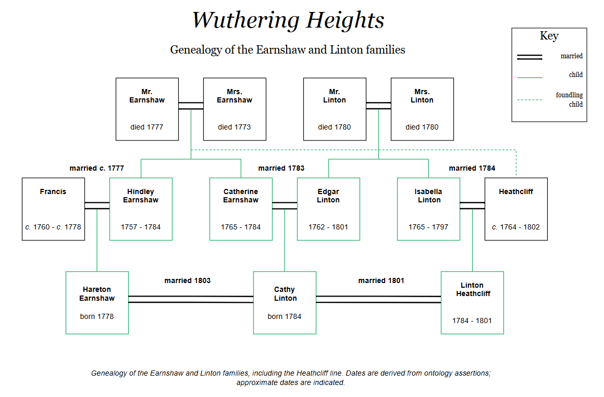
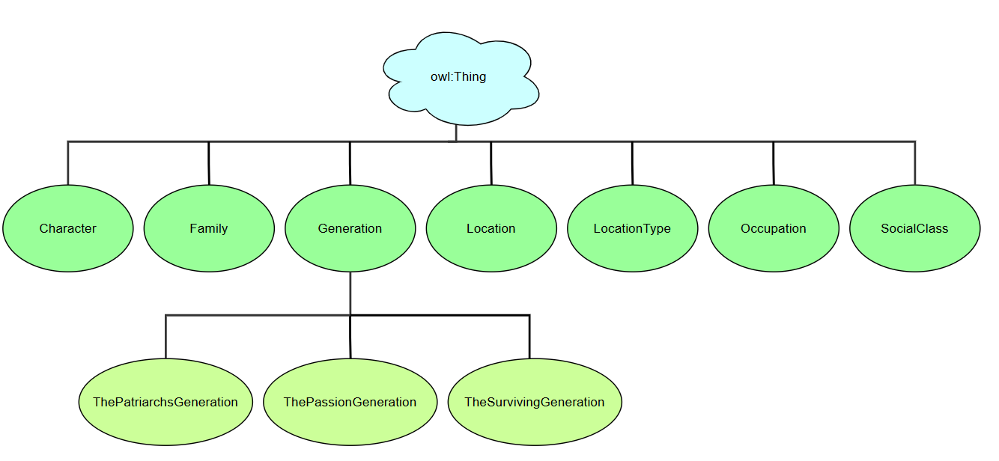
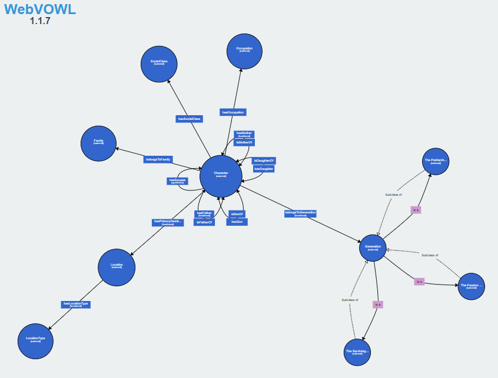
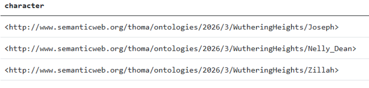
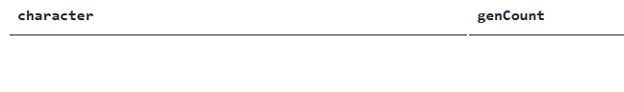
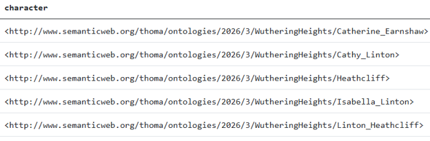

# Ontology Practice 2: Wuthering Heights
## Contents
- [About](#About) <br>
- [My Wuthering Heights ontology](#My-WH-ontology) <br>
- [Ontology details](#Details) <br>
- [Challenges & key decisions](#Challenges) <br>
- [Left undone](#Undone) <br>
- [Validating](#Validating) <br>
- [Discoveries in the Moors](#Discoveries) <br>
- [Acknowledgements](#Acknowledgements) <br>

<a name="About"></a> 
## About
As mentioned in the [Introduction](https://thomas-m-chapman.github.io/Ontology-Practice.html#Introduction), I first conceived of the idea of creating this ontology when I was in the middle of creating the Knowledge Management ontology. 

I was reading *Wuthering Heights* at the time, rather spottily, and before long I’d become lost in the swirl of filial relationships, the status implicit in the houses of the Lintons and the Earnshaws, the significance of social class at the turn of the 19th century, and the disruption caused by a mysterious outsider named Heathcliff who had been taken in by Mr. Earnshaw for unstated reasons and raised as his own child. I had to read and reread various sections to get my bearings, and at some point sketched out a simple genealogy to help make sense of who was who. 

It was then that I thought it would be a fun challenge to create an ontology for *Wuthering Heights*. Doing so would require a close read of the novel (which to that point I had not been doing) which in turn would give me a deeper appreciation for the novel and the complex themes Emily Bronte was weaving.

Here is the genealogy that I created. I referenced it often while reading the book, and I found it just as useful when I created the ontology.

&nbsp;

<a name="My-WH-ontology"></a> 
## My Wuthering Heights ontology
The complexity of the Wuthering Heights ontology is derived from the novel’s 18 characters, the many interweaving family relationships, and the social class dynamics that defined the characters’ fates. From those elements come a variety of ontology constructs, including symmetric properties, functional properties, and the annotations that I authored to explain both narrative context and the modeling decisions that I made.

For this ontology I chose those elements that I believe contribute most to the novel’s central themes: family, social class, relationships between families of different social classes, subjective truth, and generational change. I also wanted my ontology to capture the novel’s complexities and ambiguities, many of which, of course, surrounded the character Heathcliff.

The following diagram illustrates the class hierarchy of the ontology:

&nbsp;
<br>

  - **Character** includes Heathcliff and each member of the Linton and Earnshaw families, the three servants, and the two narrators (Lockwood and Nelly Dean) whose perspectives shape the story.
  - **Family** describes the two primary families, the Earnshaws and the Lintons, and the introduction of the Heathcliff family.
  - **Generation** describes three generations of the families, from the patriarchs to the few surviving family members who could revitalize their family lineage.
  - **Location** and **Location Type** include Wuthering Heights and Thrushcross Grange, as well as a few lesser places that are thematically important. Location Type identifies each location as a residence, village, or natural landscape. 
  - **Occupation** includes the three known occupations of landowner, family lawyer, and servant. 
  - **Social Class** includes several 19th-century social classes suggested but never named in the novel: Minor Gentry, Yeoman Farmer, Laborer, and the derided Outsider class.

<br>
All in all, the WH ontology consists of:
- 7 classes and 3 subclasses
- 15 object properties modeling character relationships such as *hasFather*, *hasDaughter*, *hasSocialClass*, and *belongsToGeneration*
- 40 individuals, or instances, representing the novel’s character names, occupations, lineage, social status, primary residence, and so on
- 8 data properties including dates of significance (*hasBirthDate*, *hasDeathDate*, *hasWeddingDate*) and social status (*isGentleman*, *hasCharacterSubclass*)
- 59 annotation assertions, which provide names and meaningful descriptions for each entity

The visualization below, from WebVOWL, provides a more exploded view of the ontology (though the details are difficult to read). 

&nbsp;

<br>
To [explore the ontology in full](https://thomas-m-chapman.github.io/Ontology-Practice.html#Explore), download the ontology (Wuthering-Heights-ontology.ttl) and open it in either Protégé or WebVOWL.

<a name="Details"></a> 
## Ontology details
The Wuthering Heights ontology includes rich **annotations** that help explain character relationships and the novel’s complex themes, such as this one: 
    *Isabella runs away from Heathcliff to raise their son, Linton, free from the darkness of Heathcliff and the shadows he casts on Wuthering Heights. Her departure severs her connection to the Earnshaw household entirely.*

Other annotations capture modeling decisions that I made, such as this annotation for the Generation class:
    *The Passion generation is comprised of the progeny of the Patriarchs generation — Hindley, Catherine, Edgar, and Isabella — and the orphan Heathcliff. This generation sows the seeds of the novel's central conflicts of passion, retribution, and social disruption.*

Similarly rich annotations help convey temporality, as done here to explain the evolving nature of Heathcliff’s social status: 
    *Heathcliff is introduced to us as an orphan, an outsider to the two families. Later in the novel, as he matures to a young adult, he leaves the area for several months and returns, as he himself asserts, a gentleman. His background, like his demeanor, is mysterious.*

Other annotations reveal implications that might not be apparent to the casual reader, such as *“Frances gains Yeoman Farmer status upon her marriage to Hindley if not already so by birth.”* The few axiomatic annotations, such as *“Mr. Earnshaw is the patriarch of the Earnshaw family,”* are provided for those perusing the ontology who aren’t familiar with the novel. **Same As** annotations make clear that individuals with different names are the same person, such as those that clarify that Nelly is also known as Ellen (her birth name), and that Catherine Earnshaw becomes Catherine Linton after marrying Edgar. And, finally, a select few provide details that might otherwise be perceived as a data gap, such as this bland annotation: *“Joseph's last name is not mentioned in the novel.”*

The ontology defines certain object properties and data properties as **functional** to constrain entity relationships to a single value per individual, such as to constrain a character to one biological mother, one primary residence, and one birth date.

**Domain** and **Range** are defined as appropriate to ensure that Reasoner inferences are accurate.

The three Generation subclasses (ThePatriarchsGeneration, ThePassionGeneration, TheSurvivingGeneration) are defined as **disjoint** to assert that each character (family member) can belong to only one generation.

**Symmetric** properties and **Inverse** relationships are defined to ensure that entity relationships are self-describing and readily apparent. Although a Reasoner can often infer the inverse of a property, explicit declarations ensure that the ontology communicates its intent clearly without relying on inference. I therefore modeled the *hasSpouse* property, for example, as symmetric because the relationship is mutual. I modeled parent-child properties, on the other hand, with explicit *inverseOf* pairs rather than as symmetric.

For similar reasons, I used the data type **xsd:gYear** instead of a generic string for date values, as recommended by OWL, so that the Reasoner treats the value as temporal data rather than as plain text.

<a name="Challenges"></a> 
## Challenges & key decisions
### Social class
Social class is one of the most prominent themes in *Wuthering Heights* and one that deserves a commensurate degree of focus in my ontology. At the turn of the 19th century in England, social class was evident in all phases of life, and one knew quite easily which social class they belonged to. The fortunate few stood at the top of British society in the royal family, while those slightly less fortunate fell into the aristocracy or, lower yet, the gentry. The overwhelming majority, however, resided in the middle class and the working class. 

You knew you were a member of the aristocracy if your name included a title conveying social rank, such as duke/duchess, baron/baroness, or earl/countess and, moreover, if you didn’t need to work for a living. You knew you were in the gentry if you owned land, and the more land you owned, the better. You knew you were in the vast majority if you didn’t own land and worked for a living, though some professions earned more prestige than others. You knew you were in the lowest of classes if you served others and had no home of your own.

This is the social world of *Wuthering Heights*, whose characters span the social classes from minor gentry (the Lintons) to the laboring class (Nelly Dean, Joseph, and Zillah). Several of the novel’s characters are carefully situated between the classes, such as the Earnshaws, who are effectively yeoman farmers, not quite elevated to the status of the Lintons, but not quite reduced to the working class. Another such character is Mr. Green, the Linton family’s attorney, who must work for a living but is esteemed in high regard nonetheless. 

#### Gentleman status
The trait that enables one to rise to a higher social class or sink to a lower one, is that of being a gentleman. It was often land ownership that conveyed gentleman status, but it was just as often how one carried oneself, one’s perceived stature, mannerisms, and money. Heathcliff and the narrator Lockwood are self-proclaimed gentlemen, though one perhaps more demonstrably than the other.

#### Outsider status
Yet another characteristic puts one’s status in doubt altogether: being an outsider. The status of Francis, resolved at the outset of the novel, is never in question and she sits peacefully alongside her husband Hindley Earnshaw. Much is to be made of Heathcliff’s status, however, as his arrival by way of Mr. Earnshaw is never explained and he has so little to show for himself—in the beginning, in any case. On the other hand, the status of Lockwood seems to be in little doubt, in part no doubt due to his age and apparent means and mannerisms, but perhaps equally due to the timing of his arrival, well after the tumult at Wuthering Heights had subsided and at a later time when, perhaps, good manners and behavior mattered more than wealth—if only in the eyes the younger generation in Hareton and Cathy. Or that may be just what the narrator Lockwood wants us to conclude.

In any case, in my ontology, social class is represented as Minor Gentry, Yeoman Farmer, Laborer, and Outsider.

I modeled Gentleman not as an individual of social class, but instead as a Boolean data property called *isGentleman*. Unlike the SocialClass class—which includes the statuses of *MinorGentry* and *YeomanFarmer* that characters belong to—*isGentleman* is a characteristic of an individual character (true or false), not a category with its own members. This distinction matters for this ontology just as it does thematically for the novel because it is through the fluid, contested status of Gentleman that Heathcliff disrupts both the generational order and the social class hierarchy of the novel.

### Generation
When contemplating Generation, I considered dividing it into just two subclasses, mirroring the novel’s two-volume structure (the novel is divided into two main sections, separated by a roughly 17-year gap). I decided instead to model three generations defined by familial lineage, which better captures the effects of Heathcliff’s arrival on successive generations of both families. This division also highlights the passage of time and the allowances that each generation grants members of society to navigate between social classes.

In Protégé, I declared the three Generation subclasses as Disjoint, ensuring that the Reasoner would flag any character incorrectly assigned to more than one generation. I asserted Generation membership only for family members, including Heathcliff, and not for minor characters. 

### Narrator and Orphan
I modeled Orphan and Narrator as data property values (via the *hasCharacterSubclass* property) rather than as distinct OWL subclasses. Modeling them as subclasses would have implied that Orphan and Narrator are discrete categories of being—innate human characteristics—and would have invited unintended inferences about characters like Frances, Lockwood, and Nelly Dean, whose lineage and role is either ambiguous or peripheral to the family structure. As data properties, these attributes remain descriptive without generating structural implications.

### Location Type
Conversely, I modeled LocationType as a class of its own, rather than a subclass of Location, simply because location types describe locations and are not locations themselves. A subclass relationship would imply that Residence is a kind of Location, but Wuthering Heights is a Location of *type* Residence. The *hasLocationType* object property, associating Location with LocationType, captures this relationship correctly.

### Sample Turtle output
The following selection from the ontology, in Turtle output, shows how these modeling decisions were built into the Wuthering Heights ontology. The annotations attempt to provide insight beyond which might be inferred directly from the model itself. 

```
###  http://www.semanticweb.org/thoma/ontologies/2026/3/WutheringHeights/Heathcliff
:Heathcliff rdf:type owl:NamedIndividual ,
                     :Character ;
            :belongsToFamily :Heathcliff_Family ,
                             :Linton_Family ;
            :belongsToGeneration :ThePassionGeneration ;
            :hasOccupation :Landowner ;
            :hasPrimaryResidence :Wuthering_Heights ;
            :hasSocialClass :Outsider ;
            :hasSon :Linton_Heathcliff ;
            :hasSpouse :Isabella_Linton ;
            :hasCharacterSubclass "Orphan" ;
            :hasDeathDate "1802"^^xsd:gYear ;
            :hasSexAssignedAtBirth "male" ;
            :hasWeddingDate "1784"^^xsd:gYear ;
            :isGentleman "true"^^xsd:boolean ;
            :survivesToEnd "false"^^xsd:boolean ;
            rdfs:comment "Heathcliff is referenced by only one name throughout the novel: Heathcliff. It's not clear if this is his first name or his last. Heathcliff is introduced to us as an orphan, an outsider to the two families. Later in the novel, as he matures to a young adult, he leaves the area for several months and returns, as he himself asserts, a gentleman. His background, like his demeanor, is mysterious." ;
            rdfs:label "Heathcliff" .

[ rdf:type owl:Axiom ;
   owl:annotatedSource :Heathcliff ;
   owl:annotatedProperty :belongsToFamily ;
   owl:annotatedTarget :Heathcliff_Family ;
   rdfs:comment "Heathcliff is the sole member of his family until his son Linton is born. The novel provides no insight into his lineage, which only emphasizes his status as an outsider."
 ] .

[ rdf:type owl:Axiom ;
   owl:annotatedSource :Heathcliff ;
   owl:annotatedProperty :belongsToFamily ;
   owl:annotatedTarget :Linton_Family ;
   rdfs:comment "Heathcliff becomes part of the Linton family upon his marriage to Isabella."
 ] .

[ rdf:type owl:Axiom ;
   owl:annotatedSource :Heathcliff ;
   owl:annotatedProperty :hasOccupation ;
   owl:annotatedTarget :Landowner ;
   rdfs:comment "Heathcliff acquires ownership of both Wuthering Heights and Thrushcross Grange through manipulation and inheritance."
 ] .

[ rdf:type owl:Axiom ;
   owl:annotatedSource :Heathcliff ;
   owl:annotatedProperty :hasPrimaryResidence ;
   owl:annotatedTarget :Wuthering_Heights ;
   rdfs:comment "Heathcliff is brought by Mr. Earnshaw to Wuthering Heights as a child and is later degraded to servant status by Hindley. After a brief departure as a young man, Heathcliff returns to acquire ownership of the estate. Wuthering Heights remains his primary residence throughout."
 ] .

[ rdf:type owl:Axiom ;
   owl:annotatedSource :Heathcliff ;
   owl:annotatedProperty :hasSocialClass ;
   owl:annotatedTarget :Outsider ;
   rdfs:comment "Heathcliff arrives to the scene an outsider with an unclear social status. Later, as a mature young man, Heathcliff returns to the scene an apparent gentleman. The novel's deliberate ambiguity about his status is captured in both the isGentleman data property and the formal SocialClass assertion."
 ] .


###  http://www.semanticweb.org/thoma/ontologies/2026/3/WutheringHeights/Heathcliff_Family
:Heathcliff_Family rdf:type owl:NamedIndividual ,
                            :Family ;
                   rdfs:label "Heathcliff Family" .

```

<a name="Undone"></a> 
## Left undone
I chose not to model the following:
- **Cardinality constraints**, such as an *exactly 2* restriction on *hasParent* to formally assert that every character has precisely two parents. To me, this would have contradicted yet another social construct that the novel might be challenging, particularly through Heathcliff.
- **Property chains**, such as modeling extended family relationships “aunt” and “uncle,” and so on, primarily in the interest of time.

I’m also now questioning my decision to model Outsider as a social class rather than as a data property value (via the *hasCharacterSubclass* property), akin to the way in which I modeled Narrator and Orphan: a class implies a fixed, essential category, while a data property captures a state that a character can move in and out of. 

Upon further reflection, modeling Outsider as a data property might have better captured the transitory state of Outsider status and one’s ability to shed that designation (or not) over time. This would also be more consistent with the novel’s other barrier-breaking themes.

<a name="Validating"></a> 
## Validating the ontology
To validate that I had modeled everything correctly, I created a handful of SPARQL queries and ran them against the ontology to verify that the results were accurate.

### Query 1: Which characters are servants? 
This query verifies that Joseph, Nelly Dean, and Zillah are correctly modeled as servants, and that no one else was incorrectly modeled as a servant.

**Query text:**
```
PREFIX wh: <http://www.semanticweb.org/thoma/ontologies/2026/3/WutheringHeights/> 

SELECT ?character 
WHERE { ?character wh:hasOccupation wh:Servant . }

```

**Query results:**
The query returned three rows, naming the three expected characters.

&nbsp;


### Query 2: Which characters belong to multiple generations?
This query verifies that no one was accidentally modeled as a member of more than one Generation. 

**Query text:**
```
PREFIX wh: <http://www.semanticweb.org/thoma/ontologies/2026/3/WutheringHeights/>

SELECT ?character (COUNT(?generation) AS ?genCount)
WHERE {
  ?character wh:belongsToGeneration ?generation .
}
GROUP BY ?character
HAVING (COUNT(?generation) > 1)

```

**Query results:**
The query returned no data, verifying that no characters were assigned to more than one Generation.

&nbsp;


### Query 3: Query 3: Which characters belong to multiple families?
This query verifies that Heathcliff, Linton, Isabella, Catherine, and Cathy were modeled as intended, as the characters who appropriately belong to multiple families via birth, marriage, or arrangement.

**Query text:**
```
PREFIX wh: <http://www.semanticweb.org/thoma/ontologies/2026/3/WutheringHeights/>

SELECT ?character (COUNT(?family) AS ?familyCount)
WHERE {
  ?character wh:belongsToFamily ?family .
}
GROUP BY ?character
HAVING (COUNT(?family) > 1)

```

**Query results:**
The query returned five rows, naming the expected five characters.

&nbsp;


<a name="Discoveries"></a> 
## Discoveries in the Moors
Creating this ontology was much like navigating the moors, a constant struggle to tame my thoughts in an attempt to define the world of *Wuthering Heights* and its many ambiguities. 

The following discoveries helped anchor my thoughts:
 - At several points of the modeling process, I was tempted to model the lack of a thing or an absence of something that I considered important to capture, such as by defining a *hasNoKnownParent* or *hasNoFamilyLastName* as relationships. I had this same instinct when creating the KM ontology, when I was tempted to model “deleted” as a valid lifecycle stage. I had to remind myself that modeling this would be the wrong thing to do, because defining such a relationship would suggest that a relationship indeed exists when in this case I’m attempting to show just the opposite. I learned that these situations should be documented in annotations instead.
 - I encountered an unexpected obstacle when the Reasoner in Protégé flagged an error: I had used the name Heathcliff for both a character individual and a Family class member. In OWL, all IRIs within an ontology must be globally unique—that is, the same identifier cannot refer to both a class and an individual. To resolve this, I renamed the family to Heathcliff_Family. It was a small fix, but it served as a useful reminder to describe entities carefully, as naming decisions have structural consequences in a formal ontology.

In the process of creating the Wuthering Heights ontology, it also occurred to me that this ontology would serve as a meaningful resource for the construction of a Wuthering Heights knowledge graph. As an ontology, it defines the schema (the classes, properties, and rules) that describe the domain of *Wuthering Heights*, and it populates that schema with specific individuals and their interrelationships, which is exactly the kind of information that would be conveyed in a knowledge graph. 

What began as a practice exercise became an absorbing subject. I came to understand *Wuthering Heights* much more deeply than I had upon my first read, as building the ontology required a close reading and precision in classifying the entities that deserved to be highlighted. I now have a much greater appreciation for the novel and the choices that Emily Bronte made to portray the marriage of two well-regarded families and the tumultuous events that occurred after a young foundling was brought into the family fold.

*Wuthering Heights*, it turns out, served as an excellent subject for an ontology. The novel’s ambiguities resisted easy classification, which made every modeling decision deliberate. 

And that, after all, is what good knowledge modeling requires of us.

<a name="Acknowledgements"></a> 
## Acknowledgements
*This work was conducted using Protégé.*

Ontology editing and reasoning were performed using Protégé Desktop, an open-source ontology editor developed and maintained by the Stanford Center for Biomedical Informatics Research.

Musen, M.A. [The Protégé project: A look back and a look forward. AI Matters](http://www.ncbi.nlm.nih.gov/pmc/articles/PMC4883684/). Association of Computing Machinery Specific Interest Group in Artificial Intelligence, 1(4), June 2015. DOI: 10.1145/2757001.2757003.
